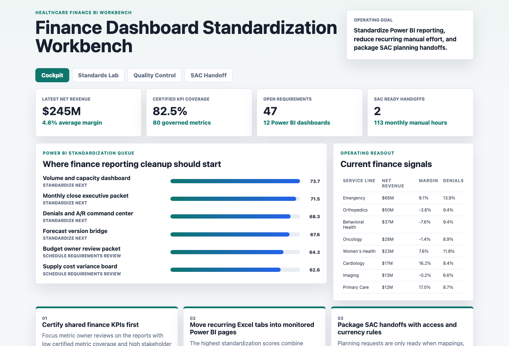
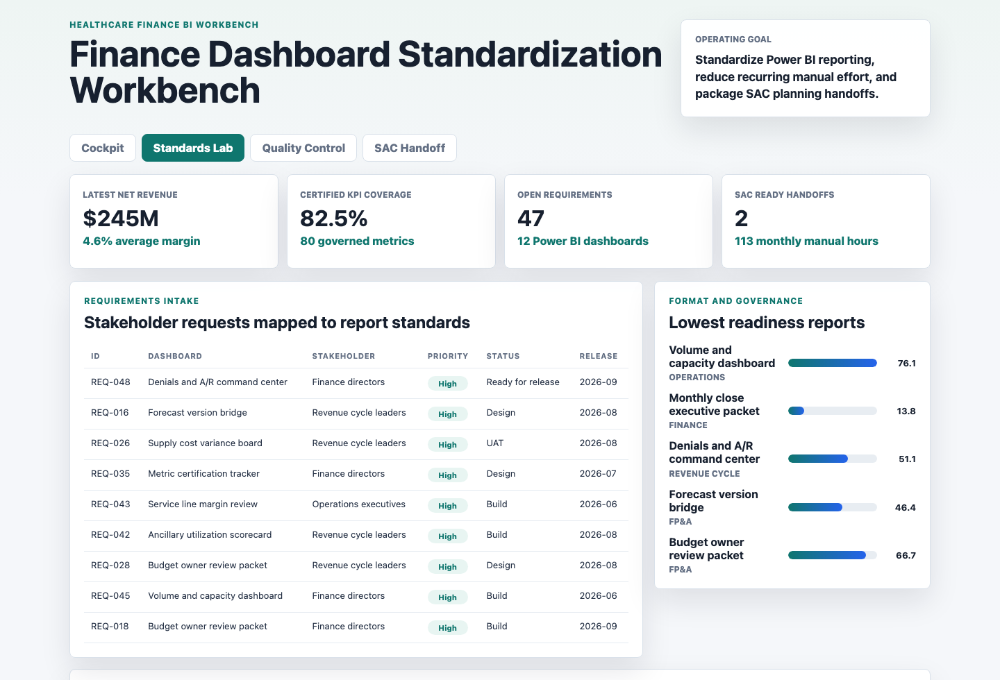
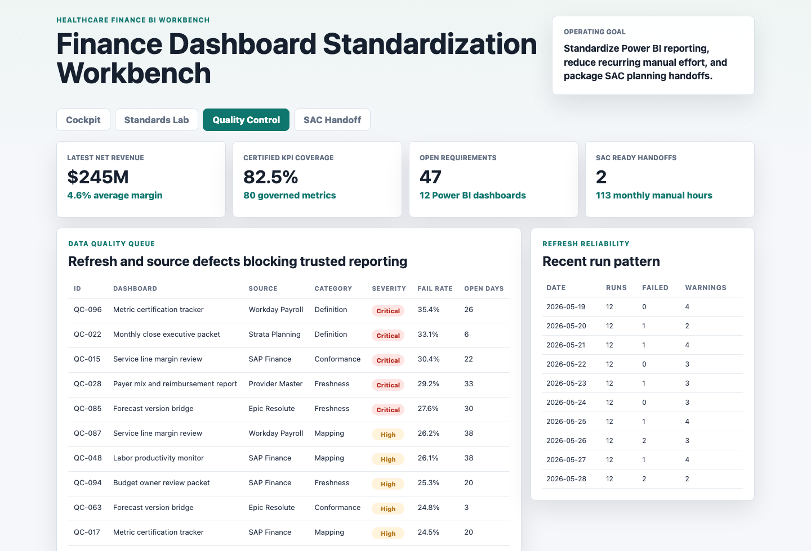
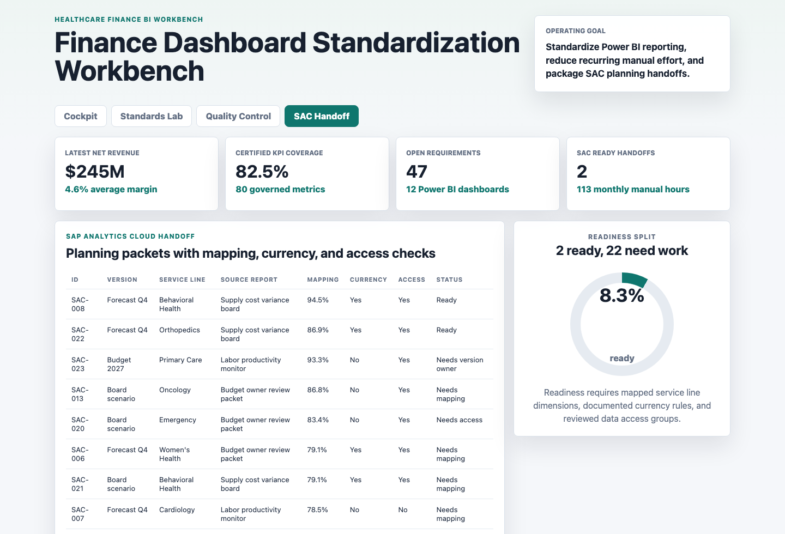

# Finance Dashboard Standardization Workbench

Portfolio artifact for a Senior Reporting and Dashboard Analyst role supporting healthcare finance and business reporting. The project models how a BI analyst can turn fragmented Power BI reporting into a governed operating workbench: standardized KPI definitions, stakeholder requirements, refresh quality checks, and SAP Analytics Cloud planning handoffs.

## Portfolio Surface



**Executive cockpit:** ranks Power BI dashboards by standardization need, then pairs the queue with service line finance signals so leaders can decide where cleanup work should start.



**Standards lab:** maps stakeholder requirements to dashboards, release months, priority, status, and KPI certification work. This demonstrates requirements gathering and translation into reporting standards.



**Data quality control:** prioritizes refresh failures, source defects, severity, failure rate, and open days so recurring reporting issues have a visible owner and fix path.



**SAP Analytics Cloud handoff:** packages planning-version requests with mapping completeness, currency-rule documentation, and data access review status.

## What This Project Demonstrates

- Power BI reporting standardization across finance, FP&A, revenue cycle, operations, and analytics portfolios.
- Stakeholder requirement intake, prioritization, and release planning.
- KPI governance through certified definitions, owners, business grain, Power BI measure labels, and SAC readiness flags.
- Reporting operations controls for refresh reliability, data quality, source ownership, and manual reporting effort.
- A defensible scoring model that ranks dashboard cleanup work by certified KPI gaps, format score, failed refreshes, quality pressure, manual hours, unresolved high-priority requirements, and SAC coverage gaps.

## Data

All data is synthetic and generated by `scripts/score_operating_data.py`. It is not real company performance data.

The data is modeled on healthcare finance reporting structures:

- Service line finance actuals such as net revenue, operating expense, margin, budget variance, adjusted cases, denial rate, and forecast accuracy.
- Power BI dashboard inventory covering audience, owner, certified metric coverage, format score, refresh SLA, manual reporting effort, and SAC coverage.
- KPI definitions with metric owner, unit, business grain, Power BI measure label, certification status, and SAC readiness.
- Stakeholder requirements from finance directors, FP&A partners, revenue cycle leaders, and operations executives.
- Refresh runs and data quality checks across common source systems such as finance, payroll, planning, claims, and provider master data.
- SAP Analytics Cloud planning handoff records with planning version, service line, mapping completeness, currency rule, access review, and next owner.

The synthetic structure is informed by public healthcare finance reporting patterns, including hospital cost reporting concepts, and by common enterprise BI operating practices. The project does not claim to represent a real organization.

## Analysis Outputs

- `analysis/outputs/app_payload.json` provides the static payload used by the workbench.
- `analysis/outputs/standardization_queue.csv` ranks dashboards for cleanup and standardization.
- `analysis/outputs/stakeholder_requirement_matrix.csv` sorts reporting requirements for stakeholder review.
- `analysis/outputs/data_quality_queue.csv` ranks source and refresh quality issues.
- `analysis/outputs/sac_planning_handoff.csv` shows SAC planning handoff readiness.
- `analysis/sql_checks.sql` documents SQL-style checks for manual effort, refresh reliability, and SAC readiness.

## Role Fit

This artifact is designed for a senior reporting analyst who needs to partner with finance and business stakeholders, translate requirements into Power BI reporting solutions, standardize dashboard logic and formats, troubleshoot recurring reporting issues, and support SAP Analytics Cloud where applicable.

It intentionally goes beyond a single dashboard screenshot. The workbench shows the operating system behind reliable finance reporting: requirement intake, metric governance, quality control, prioritization, and planning handoff readiness.

## Scope

What it does:

- Creates a complete synthetic healthcare finance reporting dataset.
- Scores dashboard standardization priority with transparent logic.
- Provides four interactive reporting surfaces in a static web app.
- Produces reusable CSV and JSON analysis outputs.
- Documents the data model, assumptions, and limitations.

What it does not do:

- It is not a live Power BI `.pbix` file.
- It does not connect to real EHR, ERP, claims, payroll, or SAP Analytics Cloud systems.
- It does not represent real healthcare organization performance.
- It does not automate deployment pipelines or row-level security in a production BI tenant.

## Run Locally

```bash
npm install
npm run analyze
npm run start
```

Open `http://127.0.0.1:4173`.

To regenerate screenshots after starting the server:

```bash
npm run screenshots
```
